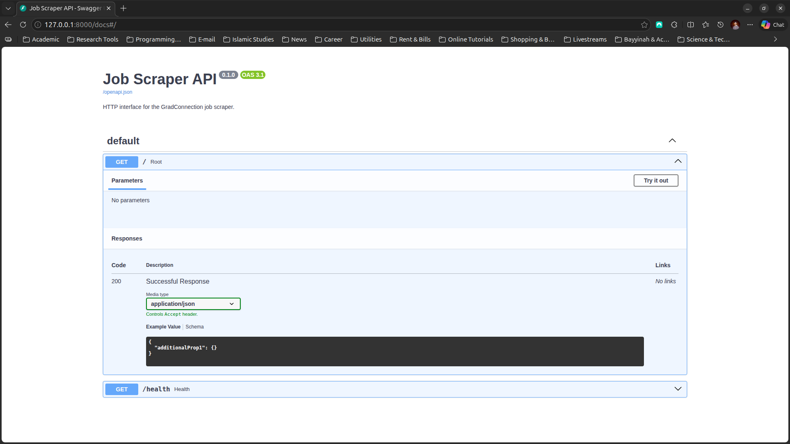
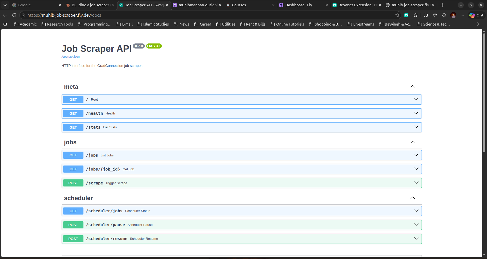
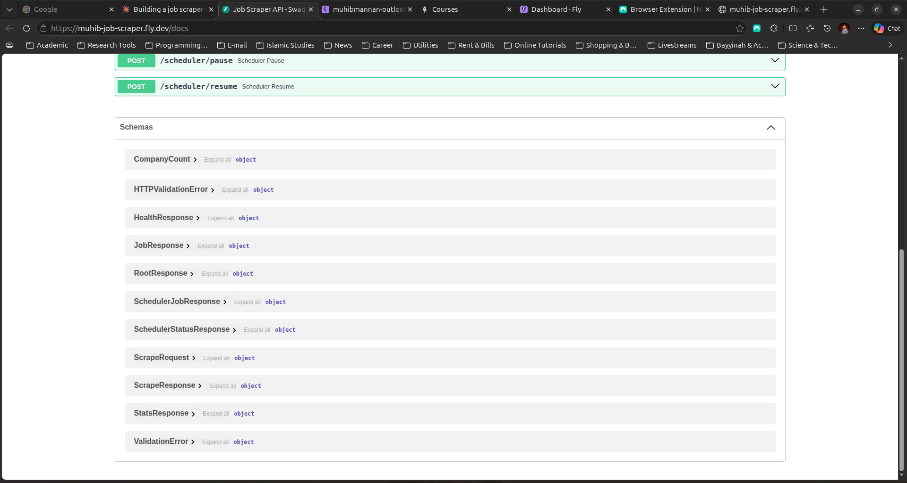

<div align="center">

# job-scraper

**A Python service that scrapes Sydney SWE graduate roles every 30 minutes and serves them over HTTP.**

Powers the `/browse` page on [jobtracker.sh](https://swe-job-tracker.vercel.app/browse).

[**Live API →**](https://muhib-job-scraper.fly.dev/docs)
&nbsp;·&nbsp;
[**Browse jobs (frontend) →**](https://swe-job-tracker.vercel.app/browse)


</div>

---

## Why I built this

I'm a Master of CS student in Sydney applying to graduate SWE roles. After my first few weeks of refreshing GradConnection by hand, I started to notice the same pain points:

- Listings change daily — easy to miss new ones
- Closing dates are deceptively soon ("Closing in 4 hours" appearing without warning)
- Browser tabs aren't a system

So I built a small Python service that fetches the Sydney SWE listings I care about every 30 minutes, dedupes by URL, and stores them in a Postgres database I own. I then expose them through a FastAPI service that my [job tracker frontend](https://github.com/muhibmannan/SWE-Job-Tracker) can consume to render a `/browse` page.

It's a side project for my own job hunt — not a product. But it's been running quietly in the background for weeks at this point, and the dollar-something a month I pay for it is a much better deal than the time I'd otherwise spend manually checking GradConnection multiple times a day.

---

## Architecture

```
┌─────────────────┐                   ┌──────────────────┐
│  GradConnection │ ◀── BeautifulSoup ┤  job-scraper     │
│  (HTML)         │   + requests      │  (Python, Fly.io)│
└─────────────────┘                   │  ┌─────────────┐ │
                                      │  │ APScheduler │ │
                                      │  │ every 30min │ │
                                      │  └─────────────┘ │
                                      └────────┬─────────┘
                                               │ psycopg
                                               ▼
                                      ┌──────────────────┐
                                      │  Supabase        │
                                      │  (Postgres)      │
                                      │  scraped_jobs    │
                                      └────────┬─────────┘
                                               │
                                               ▼
                                      ┌──────────────────┐
                                      │  FastAPI         │
                                      │  /jobs, /stats   │
                                      └────────┬─────────┘
                                               │ HTTPS + CORS
                                               ▼
                                      ┌──────────────────┐
                                      │  jobtracker.sh   │
                                      │  /browse page    │
                                      │  (Next.js,Vercel)│
                                      └──────────────────┘
```

Single Fly.io machine in Sydney runs both the scheduler and the API. They share one Postgres connection pool. ~256 MB RAM, ~$2/month.

---

## Building it

I built this in phases, starting with a minimal HTTP shell to validate FastAPI's auto-generated docs, then layering on real scraping, persistence, scheduling, and deployment. Two snapshots of the API surface tell that story.

### Phase 2 — Minimal API shell (local, May 2)

The first version just wrapped a CLI scraper in a thin FastAPI app: `/` returned service metadata, `/health` returned `{"status": "ok"}`. No real endpoints yet — just enough to confirm the structure worked and Swagger UI was rendering correctly.



### Phase 4 — Production API (deployed to Fly, May 5)

Three weeks later the API has three logical groups (`meta`, `jobs`, `scheduler`), Pydantic-typed request/response schemas, and runs on Fly.io with an in-process scheduler firing every 30 minutes.



The auto-generated schemas live alongside the endpoints — the same Pydantic models used to validate inputs and serialise outputs are reflected directly in the `/docs` UI.



---

## API

Live at `https://muhib-job-scraper.fly.dev` — interactive docs at [/docs](https://muhib-job-scraper.fly.dev/docs).

| Method | Path                | Description                                         |
| ------ | ------------------- | --------------------------------------------------- |
| GET    | `/`                 | Service metadata                                    |
| GET    | `/health`           | Liveness check                                      |
| GET    | `/stats`            | Total jobs, breakdown by source, top companies      |
| GET    | `/jobs`             | List jobs — filters: `category`, `company`, `limit` |
| GET    | `/jobs/{job_id}`    | Fetch a single job                                  |
| POST   | `/scrape`           | Manually trigger a scrape                           |
| GET    | `/scheduler/jobs`   | Inspect APScheduler state                           |
| POST   | `/scheduler/pause`  | Pause auto-scraping                                 |
| POST   | `/scheduler/resume` | Resume auto-scraping                                |

Schemas are auto-generated from Pydantic models — see the `/docs` Swagger UI for full request/response shapes.

### Example

```bash
$ curl https://muhib-job-scraper.fly.dev/stats
{
  "total": 49,
  "by_source": {
    "gradconnection-graduate": 24,
    "gradconnection-internship": 25
  },
  "top_companies": [
    {"company": "tiktok", "count": 8},
    {"company": "ntt data", "count": 7}
  ]
}
```

---

## Tech stack

- **Language:** Python 3.12
- **Web framework:** FastAPI + Uvicorn
- **Scheduler:** APScheduler (in-process, runs alongside the API)
- **Database:** Supabase Postgres via psycopg 3
- **Scraping:** requests + BeautifulSoup (no headless browser — GradConnection is server-rendered)
- **Deployment:** Docker → Fly.io (Sydney region)
- **Config:** python-dotenv for local, Fly secrets for production

---

## Local development

Prerequisites: Python 3.12+, a Supabase project, and a `DATABASE_URL` connection string.

```bash
# Clone and install
git clone https://github.com/muhibmannan/job-scraper
cd job-scraper
python -m venv .venv
source .venv/bin/activate
pip install -r requirements.txt

# Set up env
cp .env.example .env
# edit .env with your DATABASE_URL

# Run the migration
psql "$DATABASE_URL" -f migrations/001_scraped_jobs.sql

# Run the CLI scraper once
python main.py

# Or run the API + scheduler
uvicorn job_scraper.api:app --reload
# Now hit http://localhost:8000/docs
```

---

## Deployment

Deployed to Fly.io on a single shared-CPU machine in Sydney. The relevant config lives in `fly.toml` and `Dockerfile`.

```bash
# First-time setup
flyctl launch --no-deploy
flyctl secrets set DATABASE_URL="postgresql://..." SCRAPE_INTERVAL_MINUTES=30

# Deploy
flyctl deploy

# Tail logs
flyctl logs -a muhib-job-scraper
```

The machine is configured with `auto_stop_machines = "off"` and `min_machines_running = 1` because the in-process scheduler needs to stay alive between requests. Scaling to zero would kill the cron loop.

---

## Things I learned

A few notes for myself, in case I ever need to remember why I made certain calls:

- **GradConnection is server-rendered if you set a real `User-Agent`.** No headless browser needed. `requests` with `User-Agent: Mozilla/5.0` returns the full HTML; without one you get a near-empty shell.
- **SQLite → Postgres migration is mostly mechanical** but bites you in subtle ways: `?` placeholders become `%s`, `IntegrityError` becomes `psycopg.errors.UniqueViolation`, and you need to use the Transaction Pooler (port 6543) for IPv4 compatibility on Fly.
- **Don't `git add` your `.venv` and SQLite files.** Did this once. Recovered with `git rm -r --cached -f .` and a proper `.gitignore`. Now I treat `.gitignore` as the first file I write in any project.
- **The scheduler must share a process with the API on Fly's smallest tier.** Two machines = double the cost; running APScheduler in the same Uvicorn process via FastAPI's `lifespan` works fine for a single source at low frequency.
- **Fly.io is no longer free as of 2024** — credit card required, ~$2-5/month minimum. New accounts can get flagged "high-risk" and need to verify at fly.io/high-risk-unlock before deploys work.

---

## Status

Currently scrapes one source: GradConnection's Sydney SWE listings (graduate + internship). The data model and FastAPI surface area are designed to support more sources without breaking the API contract — the `source` field on each job is a free-form string. Adding LinkedIn or Seek would be another `Scraper` subclass.

Long-term, I'd like to add:

- A "save to my pipeline" button on the frontend that writes selected jobs into the [jobtracker.sh](https://github.com/muhibmannan/SWE-Job-Tracker) `applications` table for a logged-in user.
- A second source (probably Seek or LinkedIn).
- Email digests for high-priority new listings.

But for now it does what I need: gives me a single page where I can see every Sydney SWE role with closing dates I can sort by.

---

<div align="center">

Built by [Muhib Mannan](https://github.com/muhibmannan) — Master of CS at Monash University.

</div>
